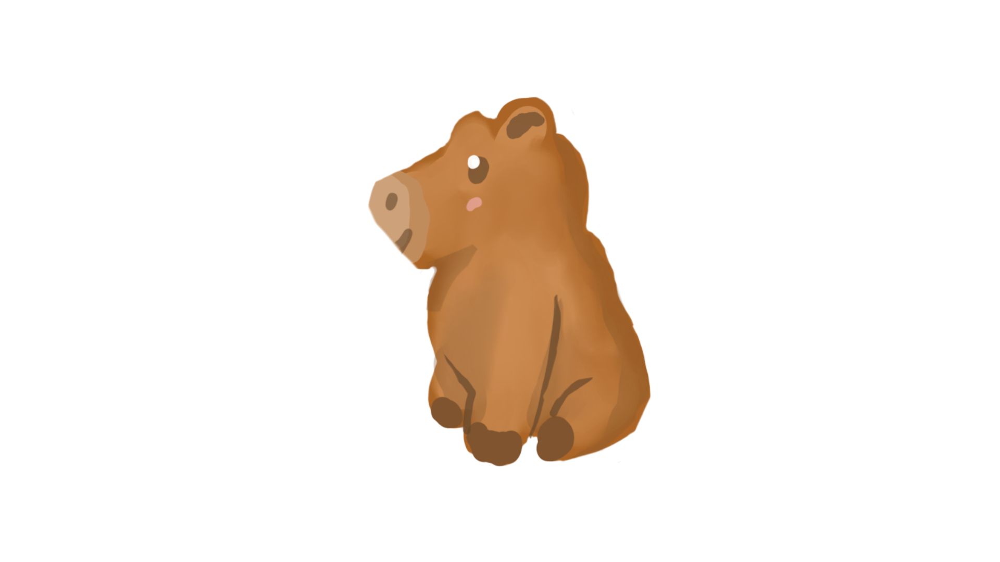
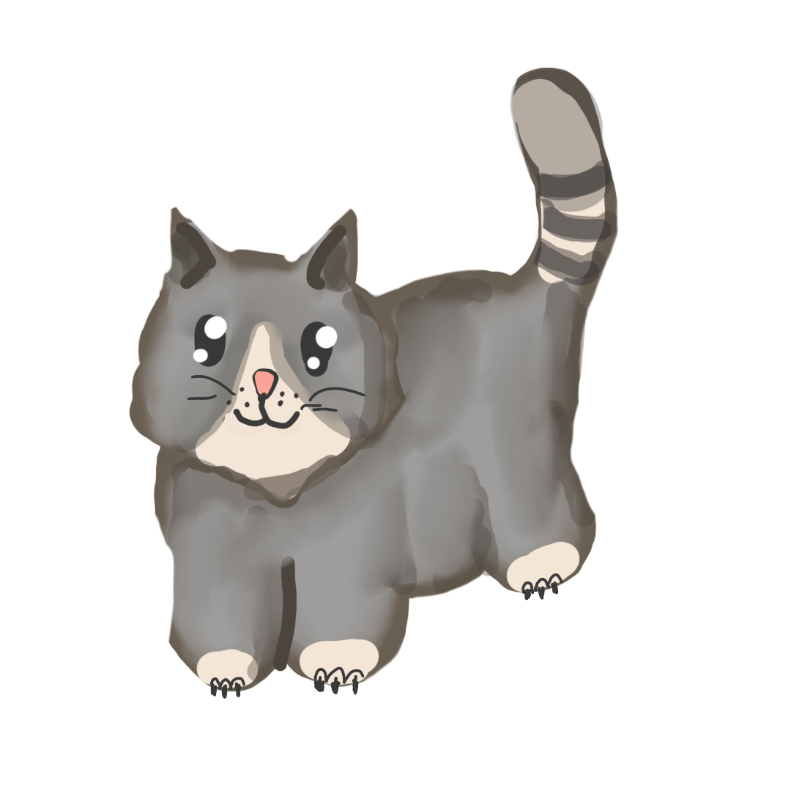
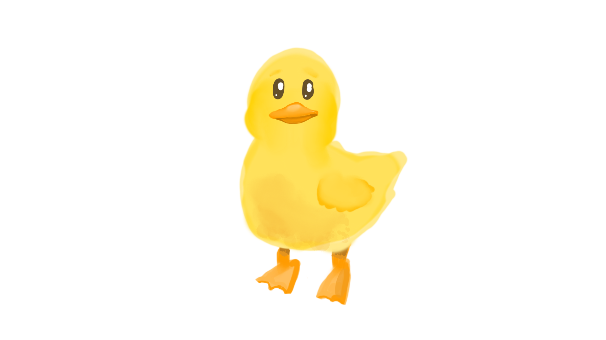
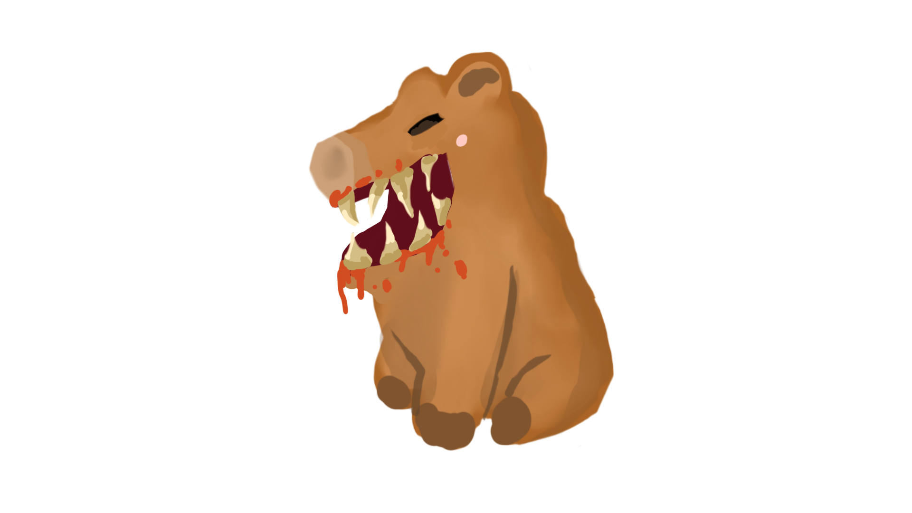
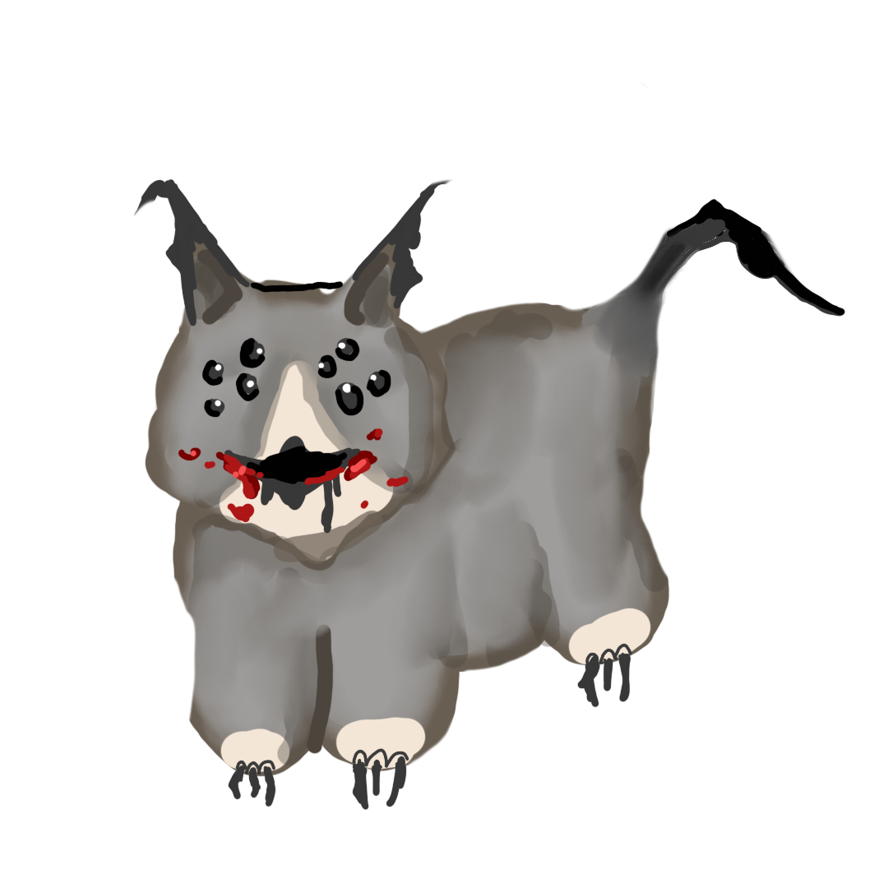
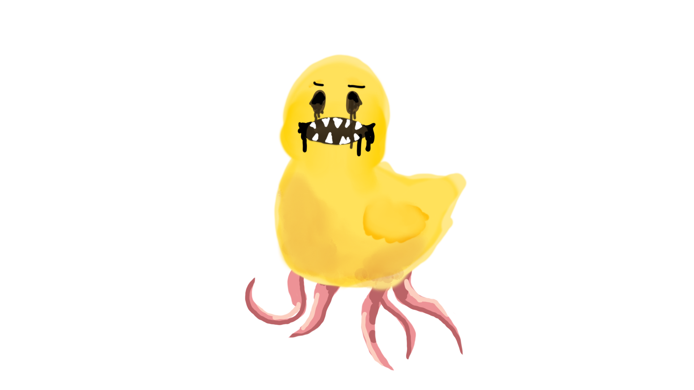

# That Slaps!

## Game Overview:
That Slaps is a fast paced game where you need to let the cute creatures into the stadium and slap evil dopplegangers away, all with simple AI motion controls. Make a quick decision, and don't touch the hedgehog!

### How to play:
Move your hand vertically to pet the creatures

and horizontally to slap the dopplegangers

do not touch the hedgehog!

## Details:
The game is written in Python 3.14. It uses Mediapipe to handle the hand tracking, and SDL2 for the rendering. All art was made by humans using a sketchbook and the Adobe suite.
The applause sound comes from https://pixabay.com/sound-effects/search/applause/; all the other sounds were either taken from royalty free sites that do not require citations or produced directly by the team.

## How to run the game:
Install Python 3.14 and install the libraries pysdl2, pysdl2-dll, and mediapipe using pip; then you can run the Game.py file (webcam required).

## Team
The FiveGuys team is composed of:
+ [Francesco Rusin](https://github.com/FrancescoRusin>) (coding)
+ [Batuhan Ozcomlekci](https://github.com/bozcomlekci) (coding)
+ [Franziska Bönisch](https://github.com/Franziska04) (art)
+ [Leonardo Sorrentino](https://github.com/bipomao) (art)
+ [Ville-Veikko Uhlgren](https://github.com/khazaam) (art)